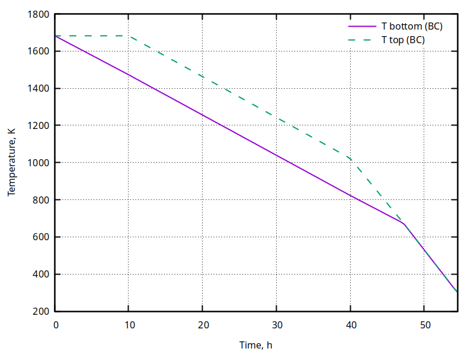
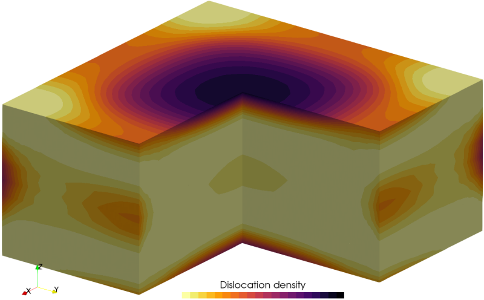

# Idealized cooling of a Gen5 Si ingot

3D temperature, stress and dislocation density solvers are verified by comparing the MACPLAS solution to the reference data from literature [Dadzis, K., Behnken, H., Bähr, T., Oriwol, D., Sylla, L., & Richter, T. (2016). Numerical simulation of stresses and dislocations in quasi-mono silicon. Journal of Crystal Growth, 450, 14-21](https://doi.org/10.1016/j.jcrysgro.2016.06.007).

Elastic and plastic calculations with the temperature-dependent material parameters are carried out by the ```run-simple.sh``` script. Comparison to the reference data is plotted using ```gnuplot``` as ```probes-compare.pdf```.




