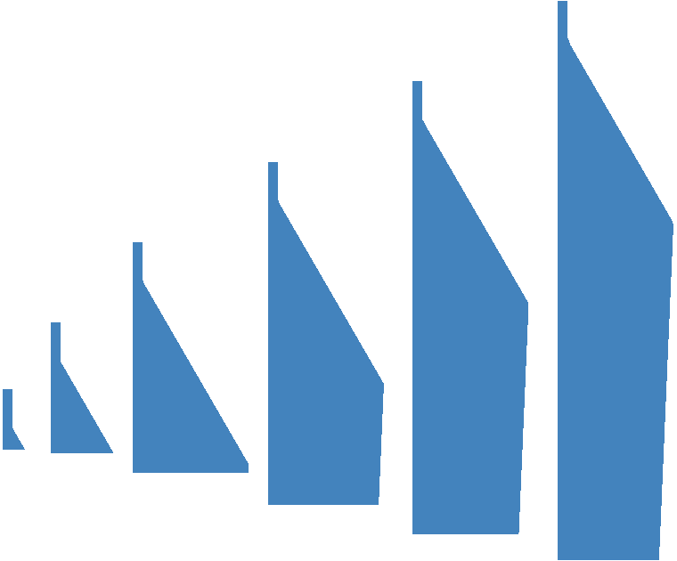

# Transient modelling of crystal growth

Calculates transient temperature, stress and dislocation density distributions in a growing Ge crystal. The process parameters are specified by the user manually or generated using ```Python``` script ```parametric-setup.py```. The mesh is created from ```mesh-2d.geo``` using ```create-mesh.sh```.

Command-line arguments:

| Argument | Explanation |
|:---------|:------------|
| ```init``` or  ```use_default_prm``` | Write ```.prm``` files with default parameters and exit |
| ```dry-run``` or ```dry_run``` | Read ```.prm``` files, initialize mesh and fields and exit |
| ```order <p>``` | Set finite element order ```p``` |

The default mode is 2D simulation using second-order finite elements.


