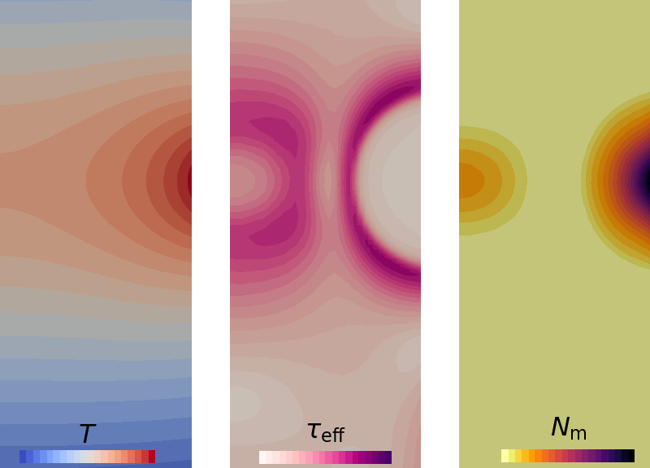

# Dislocation generation at elevated temperatures by inductive heating

Numerical simulation of the temperature, stress and dislocation density dynamics based on the silicon crystal heating experiment from literature [Rost, H. J., Buchovska, I., Dadzis, K., Juda, U., Renner, M., & Menzel, R. (2020). Thermally stimulated dislocation generation in silicon crystals grown by the Float-Zone method. Journal of Crystal Growth, 552, 125842.](https://doi.org/10.1016/j.jcrysgro.2020.125842).

The mesh is read from ```mesh-<dim>d.msh```, where the dimension ```dim``` is 2 (axisymmetric simulation) or 3.
Inductive heating is implemented by considering user-defined surface heat flux density (high-frequency EM field is assumed) read from ```qEM-2d.txt``` or ```qEM-3d.vtu```, with an option to take into account the time-dependent inductor current and vertical position, as well as the temperature-dependent electrical conductivity.

Command-line arguments:

| Argument | Explanation |
|:---------|:------------|
| ```init``` or  ```use_default_prm``` | Write ```.prm``` files with default parameters and exit |
| ```order <p>``` | Set finite element order ```p``` |
| ```2d``` or ```2D``` | 2D simulation mode |
| ```3d``` or ```3D``` | 3D simulation mode |

The default mode is 2D simulation using second-order finite elements.


