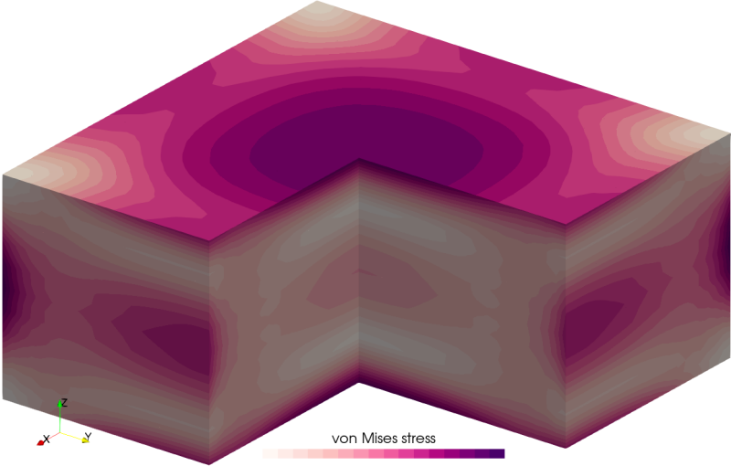

# Thermal stress solver

A simple thermal stress calculation program using user-defined temperature field T(x,y,z) specified in ```problem.prm```. The mesh is read from ```mesh-<dim>d.msh```, where the dimension ```dim``` is 2 (axisymmetric simulation) or 3. An example of ```gmsh``` script file ```mesh-3d.geo``` to generate the mesh is provided.

Command-line arguments:

| Argument | Explanation |
|:---------|:------------|
| ```init``` or  ```use_default_prm``` | Write ```.prm``` files with default parameters and exit |
| ```order <p>``` | Set finite element order ```p``` |
| ```2d``` or ```2D``` | 2D simulation mode |

The default mode is 3D simulation using second-order finite elements.


