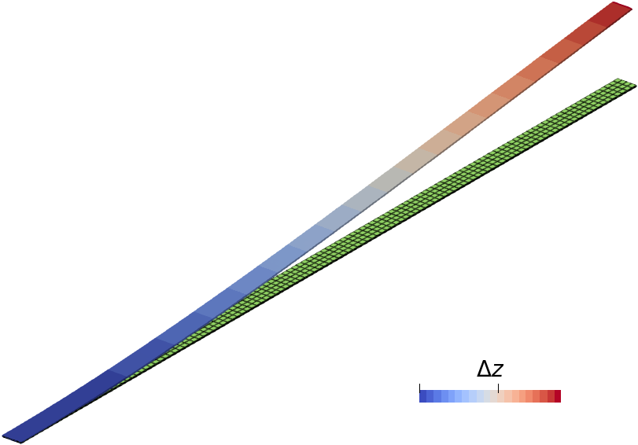

# Elastic stress solver test

Verification of the elastic stress solver is carried out for 3D beam case with applied boundary force. Comparison to the analytical solutions is plotted by the ```gnuplot``` script ```plot-x.plt```.


