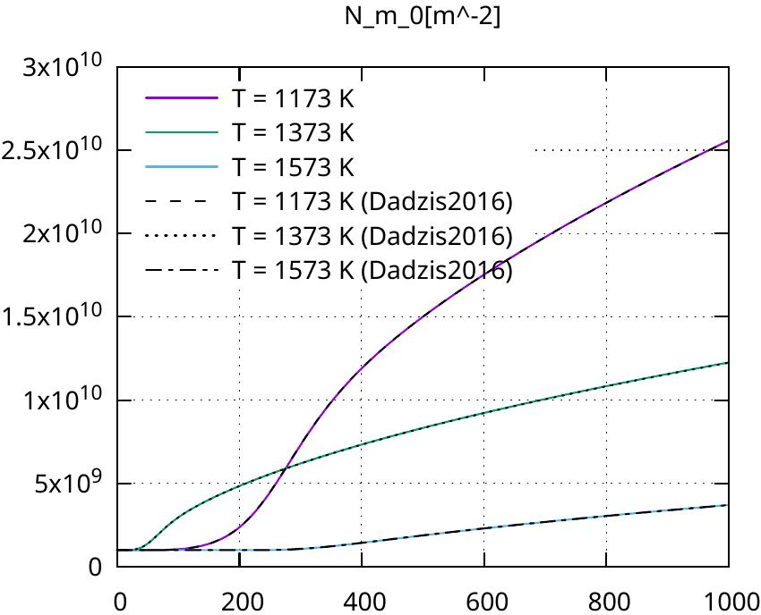

# Dislocation density solver test

A simple zero-dimensional dislocation density calculation program. The results are verified by comparing the MACPLAS solution to the reference data from literature [Dadzis, K., Behnken, H., Bähr, T., Oriwol, D., Sylla, L., & Richter, T. (2016). Numerical simulation of stresses and dislocations in quasi-mono silicon. Journal of Crystal Growth, 450, 14-21](https://doi.org/10.1016/j.jcrysgro.2016.06.007).

Temperature field is homogeneous, uniaxial stress is applied.
Comparison to the reference data is handled by the ```run-calibration.sh``` script.


