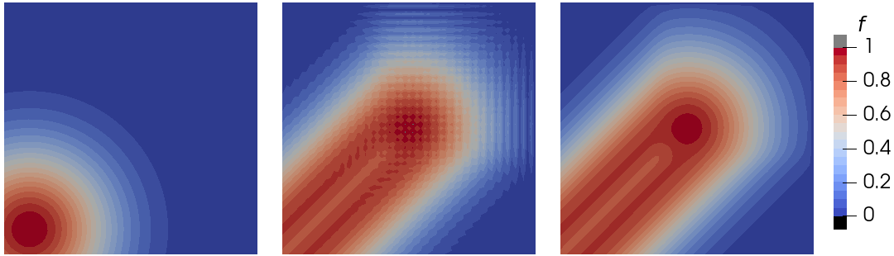

# Advection solver test

Test of the advection solver in 2D with first-type boundary conditions. The velocity and initial distribution (coordinate function) can be specified. Shown below is the initial field (left), simulation result without stabilization (center) and with stabilization (right).

